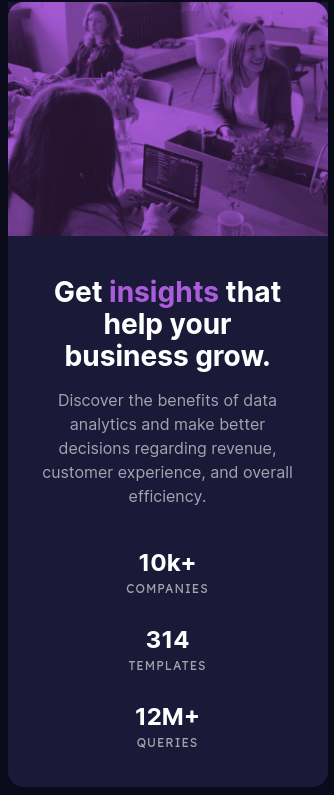

- Превью: https://kseylo.github.io/stats-preview-card/

## Установка:

Установка зависимостей
```
pnpm install
```

Запуск
```
pnpm dev
```

## Скриншоты:

### ПК:


### Телефон:



## Технологии которые использовал:
- HTML
- CSS

## Проблемы с которыми столкнулся:
- Использование разных изображений в зависимости от ширины экрана

Решение:
Для экранов шириной до 70em(1120px) используем mobie.jpg, а от 70em используем desktop.jpg. Если тег source не поддерживается браузером, то используется тег img
```html
        <picture>
          <source
            media="(max-width: 70em)"
            srcset="assets/images/image-header-mobile.jpg"
          />
          <source
            media="(min-width: 70em)"
            srcset="assets/images/image-header-desktop.jpg"
          />
          
        </picture>
```

- Применение фиолетового фильтра на изображение

Решение:
Обернул picture в блок div
```html
      <div class="image-overlay">
        <picture class="image-overlay">
          <source
            media="(max-width: 70em)"
            srcset="assets/images/image-header-mobile.jpg"
          />
          <source
            media="(min-width: 70em)"
            srcset="assets/images/image-header-desktop.jpg"
          />
          
        </picture>
      </div>
```
И применил вот такие стили для блока обертки и самого изображения
```css
.image-overlay {
/* Устанавливаем фон контейнера в фиолетовый цвет */
  background-color: var(--soft-violet); 
  width: 100%;
  max-width: 32rem; 
}

.image-overlay img {
  mix-blend-mode: multiply; /* Применяем режим смешивания для изображения */
  opacity: 0.8; /* Устанавливаем непрозрачность изображения на уровне 0.8 (80%) */
  height: 100%;
}

```